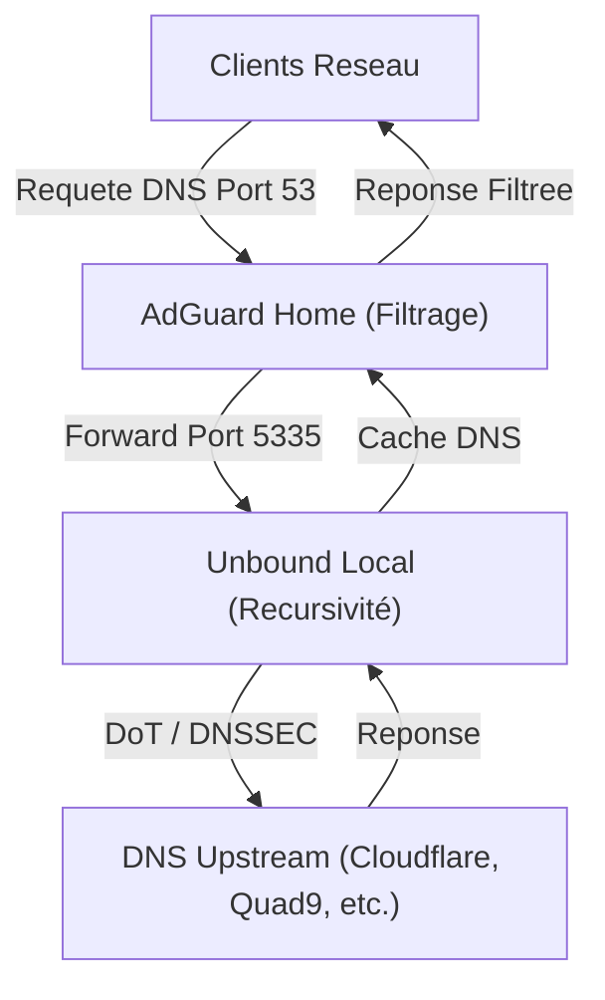

# AdGuard Home & Unbound All-in-One Installer pour Proxmox LXC

[](https://opensource.org/licenses/MIT)

Ce script Bash installe et configure **AdGuard Home** et **Unbound** comme solution DNS complète sur un conteneur **Proxmox LXC** (basé sur Debian/Ubuntu).

Inspiré par le style des [Proxmox VE Helper-Scripts](https://tteck.github.io/Proxmox/), il propose une **interface interactive** (menu Whiptail) et une configuration **ultra-optimisée** basée sur les ressources de votre système.


## 🏗️ Architecture DNS



## ✨ Fonctionnalités

### 🚀 Installation & Mise à jour

- **AdGuard Home** : Téléchargement automatique (GitHub) avec **vérification d'intégrité SHA256**.
- **Unbound** : Installation et configuration récursive haute performance.
- **Récupération Intelligente** : Détecte une installation existante et optimise la configuration sans écraser vos données (filtres, stats).

### ⚙️ Optimisation Dynamique (Multi-Tiers)

Le script analyse vos cœurs CPU et votre RAM pour calibrer Unbound scientifiquement :

- **Threads & Slabs** : Alignés sur le nombre de cœurs (Puissance de 2) pour réduire la contention (Lock Contention).
- **Buffers Réseau** : Augmentation des buffers UDP (Sysctl) pour encaisser les pics de trafic.
- **Profils Mémoire** : De **Micro** (< 512MB) à **Premium** (> 4GB).

### 🛡️ Sécurité & Gestion

- **DNS-over-TLS (DoT)** : Cloudflare ou Quad9 configurés nativement.
- **Nouveau Menu (v3.1.0)** :
  - **Réparer / Optimiser** : Recalcule la config Unbound sans réinstaller.
  - **Désinstaller** : Suppression propre et complète.
  - **Stats** : Vue en temps réel de l'efficacité du cache.
- **Auto-Update (v3.2.0)** : Le script peut se mettre à jour tout seul.

## 🚀 Installation Rapide

```bash
bash -c "$(curl -fsSL https://raw.githubusercontent.com/nickdesi/unbound-adguard-installer/main/install_unbound_interactive.sh)"
```

Ou clonez le dépôt :

```bash
git clone https://github.com/nickdesi/unbound-adguard-installer.git
cd unbound-adguard-installer
chmod +x install_unbound_interactive.sh
sudo ./install_unbound_interactive.sh
```

## 📋 Options de Ligne de Commande

```text
Usage: ./install_unbound_interactive.sh [OPTION]

Options:
  --install        Installation complete (AdGuard Home + Unbound)
  --update         Mise a jour complete
  --unbound-only   Installer uniquement Unbound
  --help           Afficher l'aide

Sans option, le script affiche un menu interactif.
```

## 🎛️ Menu Interactif (v3.2.0)

1. **Installation Complète (Safe & Idempotent)** : Déploiement total AdGuard Home + Unbound.
2. **Optimiser / Réparer Config Unbound** : Recalibre Unbound sur une installation existante (idéal si vous changez les ressources du LXC).
3. **Mettre à jour OS & Paquets** : Debian/Ubuntu upgrade.
4. **Mettre à jour ce Script** : Récupère la dernière version depuis GitHub.
5. **Stats Unbound** : Consultez l'efficacité de votre cache.
6. **Désinstaller Tout** : Suppression complète.
7. **Quitter**

## ⚙️ Configuration par défaut

- **Unbound** : Port `5335` (localhost)
- **AdGuard Home UI** : Port `3000`
- **Logs** : `/var/log/adguard-unbound-installer.log`

## 🔧 Dépannage & Logs

### Voir les logs du script

```bash
tail -f /var/log/adguard-unbound-installer.log
```

### Vérifier les services

```bash
sudo systemctl status AdGuardHome
sudo systemctl status unbound
sudo unbound-checkconf
```

### Test de résolution directe (Unbound)

```bash
dig @127.0.0.1 -p 5335 google.com
```

## 🔄 Migration LXC Debian → Alpine

Un script dédié permet de migrer votre configuration DNS complète vers un conteneur Alpine Linux.

### Prérequis

1. Conteneur **source** : LXC Debian avec AdGuard Home + Unbound (installés via ce script)
2. Conteneur **cible** : LXC Alpine avec AdGuard Home pré-installé via [community-scripts](https://github.com/community-scripts/ProxmoxVE)

### Utilisation (depuis l'hôte Proxmox)

```bash
# Télécharger et exécuter
curl -fsSL https://raw.githubusercontent.com/nickdesi/unbound-adguard-installer/main/migrate_dns_lxc.sh -o migrate_dns_lxc.sh
chmod +x migrate_dns_lxc.sh
sudo ./migrate_dns_lxc.sh <SOURCE_ID> <TARGET_ID>

# Exemple : migrer du CT 100 vers CT 101
sudo ./migrate_dns_lxc.sh 100 101
```

### Fonctionnalités du script de migration

- ✅ Sauvegarde automatique via `pct pull`
- ✅ Migration des configs AdGuard (YAML + data/stats)
- ✅ Migration de la config Unbound
- ✅ Installation d'Unbound sur Alpine (`apk add`)
- ✅ Gestion des services systemd (Debian) ↔ OpenRC (Alpine)
- ✅ Vérifications de sécurité et permissions
- ✅ Test de résolution DNS post-migration

## 📜 Licence

Ce projet est sous licence MIT. Voir le fichier [LICENSE](LICENSE) pour plus de détails.

## 🙏 Crédits

- Inspiré par [tteck's Proxmox VE Helper-Scripts](https://github.com/community-scripts/ProxmoxVE)
- [AdGuard Home](https://adguard.com/adguard-home/overview.html)
- [NLnet Labs Unbound](https://nlnetlabs.nl/projects/unbound/about/)

## ⚠️ Disclaimer

Ce script modifie la configuration système. Utilisez-le à vos propres risques. Il est recommandé de faire des sauvegardes avant toute modification majeure.
