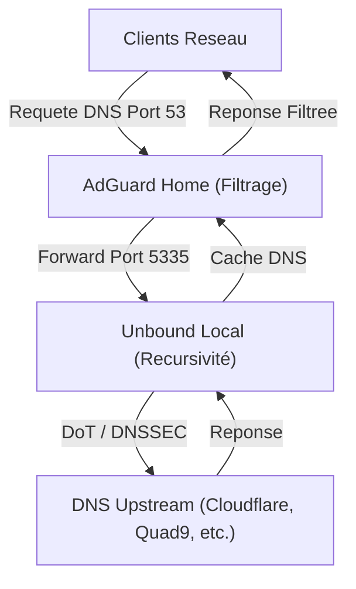

# AdGuard Home & Unbound All-in-One Installer pour Proxmox LXC

[](https://opensource.org/licenses/MIT)

Ce script Bash installe et configure **AdGuard Home** et **Unbound** comme solution DNS complète sur un conteneur **Proxmox LXC** (basé sur Debian/Ubuntu).

Inspiré par le style des [Proxmox VE Helper-Scripts](https://tteck.github.io/Proxmox/), il propose une **interface interactive** (menu Whiptail) et une configuration **ultra-optimisée** basée sur les ressources de votre système.


## 🏗️ Architecture DNS



## ✨ Fonctionnalités

### 🚀 Installation & Mise à jour

- **AdGuard Home** : Téléchargement automatique (GitHub) avec **vérification d'intégrité SHA256**.
- **Unbound** : Installation et configuration récursive haute performance.
- **Mise à jour Intelligente** : Un seul clic pour tout mettre à jour (Logique de préservation réseau incluse).

### ⚙️ Optimisation Dynamique (Multi-Tiers)

Le script analyse vos ressources (CPU/RAM) et adapte dynamiquement plus de 15 paramètres Unbound (`slabs`, `threads`, `caches`, `infra-cache`, etc.) selon 5 paliers :

- **Micro** (< 512MB) | **Petit** (512MB-768MB) | **Moyen** (768MB-1GB) | **Grand** (1-2GB) | **Premium** (> 2GB)

### 🛡️ Sécurité & Performance

- **DNS-over-TLS (DoT)** : Vos requêtes amont sont chiffrées.
- **DNSSEC** : Validation de l'authenticité des réponses.
- **Sysctl Tuning** : Optimisation de la pile TCP/UDP du LXC pour le trafic DNS.
- **Cache Warm-up** : Préchauffage automatique des domaines populaires après installation.

## 🚀 Installation Rapide

```bash
bash -c "$(curl -fsSL https://raw.githubusercontent.com/nickdesi/unbound-adguard-installer/main/install_unbound_interactive.sh)"
```

Ou clonez le dépôt :

```bash
git clone https://github.com/nickdesi/unbound-adguard-installer.git
cd unbound-adguard-installer
chmod +x install_unbound_interactive.sh
sudo ./install_unbound_interactive.sh
```

## 📋 Options de Ligne de Commande

```text
Usage: ./install_unbound_interactive.sh [OPTION]

Options:
  --install        Installation complete (AdGuard Home + Unbound)
  --update         Mise a jour complete
  --unbound-only   Installer uniquement Unbound
  --help           Afficher l'aide

Sans option, le script affiche un menu interactif.
```

## 🎛️ Menu Interactif (v2.0.0)

1. **Installation Complete** : Déploiement total AdGuard Home + Unbound.
2. **Mise a jour Complete** : Tout mettre à jour vers les dernières versions.
3. **Optimiser la Configuration Unbound** : Recalibre Unbound sur une installation existante (idéal si vous changez les ressources du LXC ou d'Upstream).
4. **Installer uniquement Unbound** : Pour ajouter Unbound à un AdGuard Home existant.
5. **Afficher les Statistiques Unbound** : Consultez l'efficacité de votre cache.
6. **Quitter**

## ⚙️ Configuration par défaut

- **Unbound** : Port `5335` (localhost)
- **AdGuard Home UI** : Port `3000`
- **Logs** : `/var/log/adguard-unbound-installer.log`

## 🔧 Dépannage & Logs

### Voir les logs du script

```bash
tail -f /var/log/adguard-unbound-installer.log
```

### Vérifier les services

```bash
sudo systemctl status AdGuardHome
sudo systemctl status unbound
sudo unbound-checkconf
```

### Test de résolution directe (Unbound)

```bash
dig @127.0.0.1 -p 5335 google.com
```

## 📜 Licence

Ce projet est sous licence MIT. Voir le fichier [LICENSE](LICENSE) pour plus de détails.

## 🙏 Crédits

- Inspiré par [tteck's Proxmox VE Helper-Scripts](https://github.com/community-scripts/ProxmoxVE)
- [AdGuard Home](https://adguard.com/adguard-home/overview.html)
- [NLnet Labs Unbound](https://nlnetlabs.nl/projects/unbound/about/)

## ⚠️ Disclaimer

Ce script modifie la configuration système. Utilisez-le à vos propres risques. Il est recommandé de faire des sauvegardes avant toute modification majeure.
