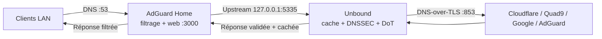

<div align="center">

# 🛡️ AdGuard Home + Unbound Installer

**Une pile DNS locale sécurisée, ultra-rapide et auto-optimisée pour Proxmox LXC — en une seule commande.**

[](https://github.com/nickdesi/unbound-adguard-installer/actions/workflows/ci.yml)
[](https://github.com/nickdesi/unbound-adguard-installer/releases)
[](LICENSE)
[](SECURITY.md)
[](https://github.com/koalaman/shellcheck)
[](https://www.proxmox.com/)

[](https://github.com/nickdesi/unbound-adguard-installer/stargazers)
[](https://github.com/nickdesi/unbound-adguard-installer/commits/main)
[](https://github.com/nickdesi/unbound-adguard-installer/issues)
[](https://github.com/nickdesi/unbound-adguard-installer/pulls)

[📘 Guide d'usage](USAGE_GUIDE.md) • [🤝 Contribuer](CONTRIBUTING.md) • [🐛 Problèmes](https://github.com/nickdesi/unbound-adguard-installer/issues)

</div>

---

Une solution **clé en main** pour déployer un résolveur DNS local de qualité « réseau d'entreprise » dans un conteneur LXC dédié sur Proxmox : filtrage publicitaire (AdGuard Home) + cache validant et chiffré (Unbound), le tout **tuné automatiquement** selon les ressources du conteneur.

> [!IMPORTANT]
> Prévu pour un **LXC dédié**, pas pour le nœud Proxmox VE. Le script bloque par défaut l'exécution sur l'hôte PVE afin d'éviter de casser le DNS du serveur ou du cluster.

---

## ✨ Fonctionnalités clés

- 🚀 **Installation en une commande** — tout est téléchargé, configuré et démarré automatiquement.
- 🧠 **Auto-tuning CPU/RAM** — caches, `outgoing-range`, buffers et `ratelimit` calculés dynamiquement (cgroup-aware).
- 🔒 **DNS-over-TLS (DoT)** — forwarding chiffré vers Cloudflare, Quad9, Google ou AdGuard.
- ✅ **DNSSEC + cache agressif** — validation, `serve-expired`, `prefetch`, NSEC agressif.
- ⚡ **Benchmarks intégrés** — sélection auto de l'upstream le plus rapide + benchmark `dnsperf` réaliste.
- 🔁 **Idempotent & sûr** — sauvegardes avant modification, mode `--dry-run`, reconfiguration sans réinstall.
- 🖥️ **Menu interactif Whiptail** + **CLI complet** pour l'automatisation.
- 🩺 **Health checks & stats** — diagnostic DNS complet et statistiques cache Unbound.

---

## 🏗️ Architecture


```mermaid
graph LR
    Clients[Clients LAN] -->|DNS :53| AGH[AdGuard Home<br/>filtrage + web :3000]
    AGH -->|Upstream 127.0.0.1:5335| UB[Unbound<br/>cache + DNSSEC + DoT]
    UB -->|DNS-over-TLS :853| DOT[Cloudflare / Quad9 / Google / AdGuard]
    DOT --> UB
    UB -->|Réponse validée + cachée| AGH
    AGH -->|Réponse filtrée| Clients
```

| Composant | Rôle | Port |
|-----------|------|------|
| AdGuard Home | Filtrage DNS + interface web | `53`, `3000` |
| Unbound | Cache DNS local + DNSSEC + DoT | `127.0.0.1:5335` |
| Upstream DoT | Résolution externe chiffrée | `853` |

---

## 🚀 Démarrage rapide (＜ 1 min)

> Fonctionne dans un **LXC Alpine Linux dédié** (Alpine 3.20+) avec accès Internet et une IP fixe.

### One-liner (recommandé)

```bash
sh -c "$(wget -qO- https://raw.githubusercontent.com/nickdesi/unbound-adguard-installer/main/setup.sh)"
```

Ou avec `curl` si déjà installé :
```bash
sh -c "$(curl -fsSL https://raw.githubusercontent.com/nickdesi/unbound-adguard-installer/main/setup.sh)"
```

Avec options (ex. installation non interactive, upstream Quad9) :

```bash
sh -c "$(wget -qO- https://raw.githubusercontent.com/nickdesi/unbound-adguard-installer/main/setup.sh)" -- --upstream quad9 --install
```

> [!IMPORTANT]
> N'utilisez **pas** `install_unbound_interactive.sh` directement en one-liner. Le script principal dépend de `lib/` ; le bootstrap `setup.sh` installe les dépendances requises, télécharge le dépôt complet puis lance l'installation.

### Installation manuelle

```bash
git clone https://github.com/nickdesi/unbound-adguard-installer.git
cd unbound-adguard-installer
./install_unbound_interactive.sh --upstream quad9 --install
```

### Simulation sans risque

```bash
./install_unbound_interactive.sh --dry-run --install
```

Une fois installé, ouvrez **`http://IP_DU_LXC:3000`** pour finaliser l'assistant AdGuard Home, puis pointez le DNS de votre box/DHCP vers l'IP du LXC. 🎉

---

## 📦 Installation

| Méthode | Commande |
|---------|----------|
| **Recommandée** (bootstrap) | `sh -c "$(wget -qO- …/setup.sh)"` |
| Manuel (git clone) | `./install_unbound_interactive.sh` |
| Non interactive + upstream | `… --upstream quad9 --install` |
| Simulation | `… --dry-run --install` |

### Prérequis Proxmox

| Ressource | Minimum | Recommandé |
|-----------|---------|------------|
| OS | **Alpine Linux 3.20+** | **Alpine Linux 3.21** |
| CPU | 1 vCPU | 2 vCPU |
| RAM | **128 MB** (LXC + AGH + Unbound < 60 MB en prod) | 512 MB+ |
| Disque | **500 MB** | 1 GB+ |
| Réseau | IP statique | IP statique + routeur pointant vers ce DNS |

---

## 🧩 Commandes

```text
Usage: ./install_unbound_interactive.sh [OPTIONS]

  --install            Installation complète (AdGuard Home + Unbound)
  --repair             Reconfigurer Unbound + AdGuard (sans réinstaller)
  --unbound-only       Installer/reconfigurer uniquement Unbound
  --retune             Re-appliquer tout le tuning sur une install existante
  --health             Health check complet (DNS, DNSSEC, DoT, services)
  --stats              Statistiques cache Unbound (unbound-control)
  --benchmark [n]      Benchmark DNS local (défaut : 300 requêtes)
  --benchmark-dnsperf  Benchmark réaliste avec dnsperf (10k requêtes)
  --update             Mettre à jour le script depuis GitHub
  --update-unbound     Mettre à jour Unbound via apk (version distro)
  --uninstall          Désinstaller AdGuard Home et Unbound
  --auto-upstream      Benchmark DoT + sélection auto du plus rapide
  --upstream <nom>      cloudflare | quad9 | google | adguard
  --dry-run             Simuler les actions sans modifier le système
  --allow-proxmox-host  Autoriser l'exécution sur le nœud Proxmox (déconseillé)
  --help                Afficher l'aide
```

**Exemples**

```bash
./install_unbound_interactive.sh --health
./install_unbound_interactive.sh --stats
./install_unbound_interactive.sh --benchmark 500
./install_unbound_interactive.sh --upstream cloudflare --repair
./install_unbound_interactive.sh --retune          # re-tune sans réinstaller
```

---

## ⚙️ Menu interactif

| # | Action | Description |
|---|--------|-------------|
| 1 | Installer | Déploiement complet + vérification finale |
| 2 | Réparer / Reconfigurer | Recalibre Unbound et réapplique l'upstream AdGuard |
| 3 | Diagnostics | Health check DNS + benchmark |
| 4 | Stats Unbound | Statistiques cache via `unbound-control` |
| 5 | MAJ Unbound | `apk add --upgrade unbound` |
| 6 | MAJ Système | `apk update && apk upgrade` |
| 7 | MAJ Script | Met à jour le script depuis GitHub |
| 8 | Reset mot de passe | Réinitialise le mot de passe AdGuard Home |
| 9 | Désinstaller | Suppression AdGuard Home + Unbound |
| 10 | Auto-Upstream | Benchmark 7 fournisseurs DoT + sélection auto |
| 11 | Benchmark DNS (dnsperf) | Benchmark réaliste avec dnsperf |
| 12 | Re-appliquer tuning | Rejoue sysctl, config Unbound, tmpfs, limites OpenRC (sans réinstaller) |
| 13 | Quitter | Ferme le menu |

---

## 🔧 Optimisation Unbound

Le script ajuste Unbound selon les ressources détectées du LXC :

| Paramètre | Stratégie |
|-----------|-----------|
| Cache rrset/msg | Calcul dynamique depuis la RAM, ratio maintenu à 2:1 |
| Key/neg cache | Dimensionnés automatiquement (bornes min/max) |
| Concurrence | `outgoing-range`, `num-queries-per-thread` selon RAM+CPU, plafonnés |
| Concurrence TCP | `incoming-num-tcp` / `outgoing-num-tcp` adaptés aux threads |
| Buffers socket | `so-rcvbuf` / `so-sndbuf` scalés par threads |
| Latence/résilience | `jostle-timeout`, `serve-expired-*`, `target-fetch-policy` dynamiques |
| Anti-DDoS | `ratelimit` (200–1000), `deny-any`, `unwanted-reply-threshold` par RAM |

Exemples indicatifs (4 vCPU) :

| RAM détectée | Cache rrset | Cache msg |
|-------------|-------------|-----------|
| 512 MB | ~256 MB | ~128 MB |
| 1 GB | ~512 MB | ~256 MB |
| 2 GB | ~1024 MB | ~512 MB |
| 4 GB+ | jusqu'à ~2048 MB | jusqu'à ~1024 MB |

---

## 📂 Configuration générée

| Élément | Valeur |
|---------|--------|
| AdGuard Home | `/opt/AdGuardHome` |
| Config AdGuard Home | `/opt/AdGuardHome/AdGuardHome.yaml` |
| Config Unbound générée | `/etc/unbound/unbound.conf.d/99-adguard-unbound-installer.conf` |
| Root hints | `/etc/unbound/root.hints` |
| Trust anchor DNSSEC | `/etc/unbound/root.key` |
| Logs installateur | `/var/log/adguard-unbound-installer.log` |
| Port Unbound | `127.0.0.1:5335` |
| Interface AdGuard Home | `http://IP_DU_LXC:3000` |

Upstream par défaut : `cloudflare`.

---

## 🩺 Dépannage

**Logs**
```bash
tail -f /var/log/adguard-unbound-installer.log
```

**Services & config (OpenRC)**
```bash
rc-service AdGuardHome status
rc-service unbound status
unbound-checkconf
```

**Tests DNS**
```bash
dig @127.0.0.1 -p 5335 google.com              # Résolution directe Unbound
dig @127.0.0.1 -p 5335 dnssec-failed.org       # DNSSEC → attendu SERVFAIL
dig @127.0.0.1 google.com                      # Via AdGuard Home
```

**Erreur « hôte Proxmox détecté »** → installez dans un LXC dédié. Le contournement existe mais reste risqué :
```bash
./install_unbound_interactive.sh --allow-proxmox-host --install
```

**Erreur « `lib/common.sh` introuvable »** → le dépôt n'a pas été cloné entièrement :
```bash
git clone https://github.com/nickdesi/unbound-adguard-installer.git
```

---

## 🧪 Tests

```bash
./tests/test_suite.sh                 # tous les tests
./tests/test_suite.sh --test validate_ipv4
```

Couverture : validation IP/port, détection système, logique de performance, backup/rollback, options CLI. Le CI exécute `shellcheck` + la suite de tests sur chaque push/PR.

---

## 🔒 Sécurité

Ce script modifie des services système, des fichiers DNS et des paramètres réseau. Des sauvegardes sont créées quand applicable. Recommandé en premier :
```bash
./install_unbound_interactive.sh --dry-run --install
```

Pour un usage Proxmox fiable : LXC Alpine isolé · IP fixe · éviter le nœud PVE · un DNS de secours côté DHCP.

---

## 🏷️ Recommandations GitHub (visibilité & bonnes pratiques)

Appliquez ces réglages dans **Settings → General** pour maximiser la découvrabilité :

- **Description** : `Installer et auto-optimiser une pile DNS AdGuard Home + Unbound (DNSSEC, DoT) ultra-légère dans un LXC Alpine Linux Proxmox — en une commande.`
- **Website** : lien vers le dépôt.
- **Topics** (jusqu'à 20) :
  `proxmox`, `lxc`, `alpine-linux`, `unbound`, `adguard-home`, `dns`, `dns-server`, `dns-over-tls`, `dnssec`, `self-hosted`, `homelab`, `bash`, `openrc`, `privacy`, `network-security`
- **Social preview** : ajoutez une image (capture du menu ou bannière) pour le partage sur les réseaux.

---

## 📄 Structure du projet

```text
unbound-adguard-installer/
├── install_unbound_interactive.sh   # script principal (orchestrateur)
├── setup.sh                         # bootstrap : télécharge le dépôt puis lance l'install
├── lib/
│   ├── common.sh                    # utilitaires obligatoires (UI, réseau, validation)
│   └── health_checks.sh             # diagnostics & benchmark (optionnel)
├── tests/
│   └── test_suite.sh                # tests unitaires
├── CHANGELOG.md  CONTRIBUTING.md  IMPROVEMENTS.md  USAGE_GUIDE.md  LICENSE
```

---

## 📚 Ressources

- [Guide d'usage](USAGE_GUIDE.md) · [Contribuer](CONTRIBUTING.md) · [Améliorations](IMPROVEMENTS.md)
- [AdGuard Home](https://adguard.com/adguard-home/overview.html) · [NLnet Labs Unbound](https://nlnetlabs.nl/projects/unbound/about/)
- Inspiré par les [Proxmox VE Helper-Scripts](https://github.com/community-scripts/ProxmoxVE)

## 📜 Licence

Projet sous licence **MIT** — voir [LICENSE](LICENSE).
