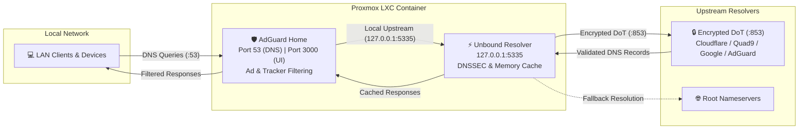

<div align="center">

# 🛡️ AdGuard Home + Unbound Installer

**A secure, ultra-fast, and auto-tuned local DNS stack for Proxmox LXC — in a single command.**

[](https://github.com/nickdesi/unbound-adguard-installer/actions/workflows/ci.yml)
[](https://github.com/nickdesi/unbound-adguard-installer/releases)
[](LICENSE)
[](SECURITY.md)
[](https://github.com/koalaman/shellcheck)
[](https://www.proxmox.com/)

[](https://github.com/nickdesi/unbound-adguard-installer/stargazers)
[](https://github.com/nickdesi/unbound-adguard-installer/commits/main)
[](https://github.com/nickdesi/unbound-adguard-installer/issues)
[](https://github.com/nickdesi/unbound-adguard-installer/pulls)

[🚀 Quick Start](#-quick-start) • [✨ Key Features](#-key-features) • [📊 Comparison](#-why-this-stack-vs-alternatives) • [🏗️ Architecture](#️-architecture) • [⚙️ CLI & Menu](#️-cli-commands--options) • [🧠 Auto-Tuning](#-automatic-resource-tuning) • [🩺 Diagnostics](#-diagnostics--troubleshooting) • [🤝 Contributing](CONTRIBUTING.md)

</div>

---

<p align="center">
  ⭐ <b>If you find this project useful, please consider giving it a star on GitHub! It helps more homelabbers discover it.</b> ⭐
</p>

---

A turnkey solution to deploy an enterprise-grade, privacy-first local DNS stack inside a lightweight **Alpine Linux Proxmox LXC container**: network-wide ad & tracker blocking (**AdGuard Home**) coupled with a high-performance, DNSSEC-validating, encrypted recursive resolver (**Unbound**) — **dynamically tuned** to your container's CPU and RAM.

> [!IMPORTANT]
> This installer is specifically designed to run inside a **dedicated LXC container** (Alpine Linux 3.20+ recommended), **not** directly on the Proxmox VE host node. The script prevents accidental execution on PVE hosts to safeguard host and cluster DNS configurations.

---

## ✨ Key Features

- 🚀 **One-Liner Deployment** — Fully automated download, configuration, service setup, and verification in under 60 seconds.
- 🪶 **Ultra-Lightweight Footprint** — Optimized for Alpine Linux; entire stack consumes **< 60 MB RAM** in production.
- 🧠 **Dynamic Resource Auto-Tuning** — Caches (`rrset`/`msg` 2:1 ratio), socket buffers, worker threads, and rate limits are calculated on-the-fly based on container cgroups.
- 🔒 **Encrypted DNS-over-TLS (DoT)** — Secure upstream forwarding with strict certificate validation (Cloudflare, Quad9, Google, AdGuard).
- ✅ **Full DNSSEC Validation & Smart Caching** — Out-of-the-box DNSSEC enforcement, aggressive NSEC caching, `serve-expired` resilience, and `prefetch`.
- ⚡ **Integrated Performance Benchmarks** — Built-in automated latency testing across DoT providers and realistic multi-query stress-testing with `dnsperf`.
- 🔁 **Idempotent & Safe Operations** — Automatic pre-modification backups, rollback mechanisms, non-destructive `--retune`, and a `--dry-run` simulation mode.
- 🖥️ **Interactive TUI + Full CLI** — Intuitive Whiptail interactive menu for human operators and scriptable flags for headless automation.
- 🩺 **Comprehensive Health Checks & Metrics** — Real-time Unbound cache hit statistics, DNSSEC failure tests, and service supervisor monitors.

---

## 📊 Why This Stack vs Alternatives?

| Feature / Metric | 🔴 Vanilla AdGuard / Pi-hole | 🟡 Debian/Ubuntu + Unbound | 🟢 **This Installer (Alpine + Unbound)** |
| :--- | :--- | :--- | :--- |
| **Base RAM Usage** | ~150 – 300 MB | ~350 – 600 MB | **⚡ < 60 MB RAM** |
| **Encrypted Upstream** | Plain UDP (manual DoH) | Manual TLS setup | **🔒 DoT (Port 853) Out-of-the-Box** |
| **DNSSEC Enforcement** | Basic / Optional | Manual config | **🛡️ Strict Automated Validation & Root Anchors** |
| **Hardware Tuning** | Static defaults | Static defaults | **🧠 Dynamic cgroups Auto-Scaling (CPU/RAM)** |
| **Zero-Latency Cache** | Standard TTL expiry | Manual persistence | **⚡ In-Memory + `serve-expired` + `prefetch`** |
| **Deployment Time** | 15 – 30 minutes | 20+ minutes | **🚀 < 60 seconds (1-liner)** |

---

## 🏗️ Architecture


```mermaid
flowchart LR
    subgraph LAN["Local Network"]
        Clients["💻 LAN Clients & Devices"]
    end

    subgraph LXC["Proxmox LXC Container"]
        AGH["🛡️ AdGuard Home<br/>Port 53 (DNS) | Port 3000 (UI)<br/>Ad & Tracker Filtering"]
        UB["⚡ Unbound Resolver<br/>127.0.0.1:5335<br/>DNSSEC & Memory Cache"]
    end

    subgraph WAN["Upstream Resolvers"]
        DoT["🔒 Encrypted DoT (:853)<br/>Cloudflare / Quad9 / Google / AdGuard"]
        ROOT["🌐 Root Nameservers"]
    end

    Clients -->|"DNS Queries (:53)"| AGH
    AGH -->|"Local Upstream (127.0.0.1:5335)"| UB
    UB -->|"Encrypted DoT (:853)"| DoT
    UB -.->|"Fallback Resolution"| ROOT
    DoT -->|"Validated DNS Records"| UB
    UB -->|"Cached Responses"| AGH
    AGH -->|"Filtered Responses"| Clients
```

### Component Port Mapping

| Component | Service Role | Listening Address / Port |
| :--- | :--- | :--- |
| **AdGuard Home** | Network filtering, client tracking & Web Dashboard | `0.0.0.0:53` (DNS), `0.0.0.0:3000` (Setup/Admin Web UI) |
| **Unbound** | Recursive caching resolver + DNSSEC + DoT | `127.0.0.1:5335` & `::1:5335` (Internal Only) |
| **Upstream DoT** | Encrypted TLS DNS transport | Outbound `TCP 853` |

---

## 🚀 Quick Start

### 1. One-Liner (Recommended)

Run the bootstrap command inside your **Alpine Linux LXC**:

```bash
sh -c "$(wget -qO- https://raw.githubusercontent.com/nickdesi/unbound-adguard-installer/main/setup.sh)"
```

*Or with `curl` (if installed):*

```bash
sh -c "$(curl -fsSL https://raw.githubusercontent.com/nickdesi/unbound-adguard-installer/main/setup.sh)"
```

### 2. Unattended / Automated Installation

Pass arguments directly to the setup bootstrap (e.g. non-interactive with Cloudflare DoT upstream):

```bash
sh -c "$(wget -qO- https://raw.githubusercontent.com/nickdesi/unbound-adguard-installer/main/setup.sh)" -- --upstream cloudflare --install
```

### 3. Manual Installation (Git Clone)

```bash
git clone https://github.com/nickdesi/unbound-adguard-installer.git
cd unbound-adguard-installer
./install_unbound_interactive.sh --upstream cloudflare --install
```

### 4. Safe Simulation Mode

Preview all actions without making system changes:

```bash
./install_unbound_interactive.sh --dry-run --install
```

---

## 🌐 Post-Installation Setup

1. **Access Web Interface**: Open your browser at **`http://<LXC_IP>:3000`** to complete the initial AdGuard Home wizard.
2. **DNS Upstream Check**: Verify that AdGuard Home's upstream is set to `127.0.0.1:5335` (*Settings → DNS Settings*).
3. **Configure Router DHCP**: Set your local router's primary DNS server to your LXC container's static IP address.

---

## ⚙️ CLI Commands & Options

```text
Usage: ./install_unbound_interactive.sh [OPTIONS]

Installation & Configuration:
  --install              Full automated installation (AdGuard Home + Unbound)
  --repair               Recalibrate Unbound & re-apply AdGuard upstream (no reinstall)
  --unbound-only         Install or reconfigure Unbound only
  --retune               Re-calculate and apply optimal tuning parameters to existing setup
  --upstream <provider>  Select DoT upstream: cloudflare | quad9 | google | adguard
  --auto-upstream        Benchmark all DoT providers and auto-select the lowest latency

Monitoring & Performance:
  --health               Run comprehensive health check (DNS, DNSSEC, DoT, services)
  --stats                Display real-time Unbound cache hits & performance stats
  --benchmark [n]        Run local DNS latency benchmark (default: 300 queries)
  --benchmark-dnsperf    Run high-throughput stress test with dnsperf (10k queries)

Maintenance & Lifecycle:
  --update               Update this script directly from GitHub
  --update-unbound       Upgrade Unbound package via distro package manager
  --uninstall            Cleanly uninstall AdGuard Home, Unbound, and configurations
  --dry-run              Simulate commands without modifying system files
  --allow-proxmox-host   Bypass PVE host check (not recommended)
  --help                 Show full help message
```

### Common CLI Examples

```bash
# Verify health and DNSSEC validation
./install_unbound_interactive.sh --health

# View live cache hit ratio and query counts
./install_unbound_interactive.sh --stats

# Change upstream provider to Quad9 and re-apply settings
./install_unbound_interactive.sh --upstream quad9 --repair

# Re-apply CPU/RAM tuning after resizing LXC resources
./install_unbound_interactive.sh --retune
```

---

## 🖥️ Interactive TUI Menu

When executed without CLI flags (`./install_unbound_interactive.sh`), a streamlined, modern Whiptail menu is presented:

```text
┌─────────────────────────── AdGuard Home + Unbound ──────────────────────────┐
│  [+] Unbound: active   [+] AdGuard: active   > Upstream: cloudflare         │
├─────────────────────────────────────────────────────────────────────────────┤
│                                                                             │
│  [1]  Install / Update Stack       Fresh deployment or 1-click global update│
│  [2]  Change Upstream DNS (DoT)    Switch to Cloudflare, Quad9 or Auto-Fast │
│  [3]  Diagnostics & Performance    Health check, DNSSEC test & Cache stats  │
│  [4]  Maintenance & Utilities      Re-apply tuning, Reset password, Remove  │
│                                                                             │
└─────────────────────────────────────────────────────────────────────────────┘
```

### Streamlined Category Workflows

- **`[1] Install / Update Stack`** — Automatically detects active state: performs initial setup or updates Script + Unbound + Alpine OS + Tuning in a single pass.
- **`[2] Change Upstream DNS`** — Switch between DoT providers (Cloudflare, Quad9, Google, AdGuard) or run the live **Auto-Benchmark** to select the fastest provider.
- **`[3] Diagnostics & Performance`** — Instant unified health checks (DNSSEC validation, ports, services), live Unbound cache stats (`unbound-control`), and `dnsperf` load testing.
- **`[4] Maintenance & Utilities`** — Recalculate hardware tuning (when modifying LXC RAM/CPU), reset AdGuard admin password, or cleanly uninstall the stack.

---

## 🧠 Automatic Resource Tuning

The installer inspects container limits and scales Unbound parameters proportionally:

| System Parameter | Optimization Strategy |
| :--- | :--- |
| **`rrset-cache-size` / `msg-cache-size`** | Dynamically sized based on RAM, enforcing a strict **2:1 ratio** |
| **`key-cache-size` / `neg-cache-size`** | Auto-scaled to handle DNSSEC validation and negative caching |
| **`outgoing-range` / `num-queries`** | Scaled to CPU core count and available RAM sockets |
| **Socket Buffers (`so-rcvbuf`/`so-sndbuf`)** | Tuned to eliminate dropped UDP packets under high bursts |
| **Resilience & Zero-Latency** | `serve-expired: yes`, `prefetch: yes`, `serve-original-ttl: yes` |
| **Security & Privacy** | `harden-dnssec-stripped`, `hide-identity`, `deny-any`, `ratelimit` |

### Sample Tuning Profiles

| Assigned RAM | `msg-cache-size` | `rrset-cache-size` | Key/Neg Cache | Target Concurrency |
| :--- | :--- | :--- | :--- | :--- |
| **128 MB** | ~16 MB | ~32 MB | ~4 MB | Lightweight home setup |
| **512 MB** | ~64 MB | ~128 MB | ~16 MB | Standard homelab (~50 devices) |
| **1 GB** | ~128 MB | ~256 MB | ~32 MB | Heavy traffic / High volume |
| **2 GB+** | ~256 MB+ | ~512 MB+ | ~64 MB | Enterprise / Multi-VLAN homelab |

---

## 📂 Generated File Locations

| File / Path | Purpose |
| :--- | :--- |
| `/opt/AdGuardHome` | AdGuard Home binary and core working directory |
| `/opt/AdGuardHome/AdGuardHome.yaml` | AdGuard Home main configuration file |
| `/etc/unbound/unbound.conf.d/99-adguard-unbound-installer.conf` | Tuned Unbound configuration file |
| `/etc/unbound/root.hints` | IANA DNS Root Zone hints |
| `/etc/unbound/root.key` | DNSSEC root trust anchor |
| `/var/log/adguard-unbound-installer.log` | Installation and maintenance log |

---

## 🩺 Diagnostics & Troubleshooting

### Check Service Status

```bash
# OpenRC (Alpine Linux)
rc-service AdGuardHome status
rc-service unbound status

# Systemd (Debian/Ubuntu)
systemctl status AdGuardHome unbound
```

### Validate Unbound Configuration

```bash
unbound-checkconf
```

### Test DNS Resolution & DNSSEC

```bash
# 1. Test direct resolution via Unbound
dig @127.0.0.1 -p 5335 google.com

# 2. Test DNSSEC validation (MUST return SERVFAIL for invalid signatures)
dig @127.0.0.1 -p 5335 dnssec-failed.org

# 3. Test resolution through AdGuard Home
dig @127.0.0.1 google.com
```

### Live Log Inspection

```bash
tail -f /var/log/adguard-unbound-installer.log
```

---

## 📋 System Requirements

| Specification | Minimum | Recommended |
| :--- | :--- | :--- |
| **Operating System** | Alpine Linux 3.20+ / Debian 12 / Ubuntu 24.04 | **Alpine Linux 3.21** (LXC) |
| **CPU Cores** | 1 vCPU | 2 vCPU |
| **Memory (RAM)** | **128 MB** *(Stack runs < 60 MB)* | 512 MB |
| **Storage** | 500 MB | 1 GB+ |
| **Network** | Static IPv4 address | Static IPv4 + IPv6 (optional) |

---

## 🧪 Automated Testing & CI

This repository uses automated unit tests and CI workflows to validate every commit:

```bash
# Run entire test suite
./tests/test_suite.sh

# Run specific validation test
./tests/test_suite.sh --test validate_ipv4
```

Continuous Integration verifies ShellCheck compliance, argument parsing, IPv4/IPv6 validators, backup/rollback procedures, and configuration templating across target environments.

---

## 🌟 Stargazers & Community

If this stack simplified your homelab or boosted your network privacy, please leave a star ⭐ — it helps keep the project maintained and visible to other self-hosters!

<div align="center">

[](https://star-history.com/#nickdesi/unbound-adguard-installer&Date)

</div>

---

## 🤝 Contributing

Contributions, feature requests, and bug reports are welcome!
Please check [CONTRIBUTING.md](CONTRIBUTING.md) and [SECURITY.md](SECURITY.md) before submitting pull requests.

---

## 📜 License

This project is open-source software licensed under the [MIT License](LICENSE).

---

<div align="center">
  <sub>Inspired by <a href="https://github.com/community-scripts/ProxmoxVE">Proxmox VE Helper-Scripts</a>. Built with ❤️ for privacy and self-hosting enthusiasts.</sub>
</div>
