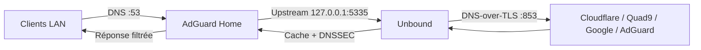

# AdGuard Home + Unbound Installer pour Proxmox LXC

[](LICENSE)
[](CHANGELOG.md)
[](https://www.gnu.org/software/bash/)
[](https://www.proxmox.com/)

Installe et configure une pile DNS locale complète dans un **conteneur Proxmox LXC Debian/Ubuntu** :

- **AdGuard Home** pour le filtrage DNS, anti-pub, anti-tracking et interface web.
- **Unbound** pour le cache DNS local, DNSSEC et forwarding sécurisé en DNS-over-TLS.
- **Tuning automatique** selon CPU/RAM du conteneur.
- **Mode interactif** Whiptail + usage CLI pour automatisation.

> [!IMPORTANT]
> Ce projet est prévu pour un **LXC dédié**, pas pour le nœud Proxmox VE. Le script bloque par défaut l’exécution sur l’hôte PVE afin d’éviter de casser le DNS du serveur ou du cluster.

---

## Sommaire

- [Architecture](#architecture)
- [Fonctionnalités](#fonctionnalités)
- [Prérequis Proxmox](#prérequis-proxmox)
- [Installation rapide](#installation-rapide)
- [Commandes utiles](#commandes-utiles)
- [Configuration générée](#configuration-générée)
- [Maintenance](#maintenance)
- [Dépannage](#dépannage)
- [Structure du projet](#structure-du-projet)
- [Tests](#tests)
- [Sécurité](#sécurité)
- [Licence](#licence)

---

## Architecture


```mermaid
graph LR
    Clients[Clients LAN] -->|DNS :53| AGH[AdGuard Home]
    AGH -->|Upstream 127.0.0.1:5335| UB[Unbound]
    UB -->|DNS-over-TLS :853| DOT[Cloudflare / Quad9 / Google / AdGuard]
    DOT --> UB
    UB -->|Cache + DNSSEC| AGH
    AGH -->|Réponse filtrée| Clients
```

| Composant | Rôle | Port |
|-----------|------|------|
| AdGuard Home | Filtrage DNS + interface web | `53`, `3000` |
| Unbound | Cache DNS local + DNSSEC + DoT | `127.0.0.1:5335` |
| Upstream DoT | Résolution externe chiffrée | `853` |

---

## Fonctionnalités

### Installation

- Détection architecture : `amd64`, `arm64`, `armv7`.
- Téléchargement automatique de la dernière version AdGuard Home.
- Installation/reconfiguration idempotente.
- Sauvegardes avant modification des fichiers sensibles.
- Arrêt clair si `lib/common.sh` est absent.

### Optimisation Unbound

Le script ajuste automatiquement Unbound selon les ressources du LXC :

| Paramètre | Stratégie |
|-----------|-----------|
| Cache rrset/msg | Calcul dynamique à partir de la RAM détectée, avec ratio maintenu à 2:1 |
| Key/neg cache | Dimensionnés automatiquement avec bornes minimales et maximales |
| Concurrence | `outgoing-range` et `num-queries-per-thread` ajustés selon RAM + CPU, bornés pour stabilité |
| Buffers socket | Adaptés par paliers mémoire pour éviter la surconsommation |
| Latence/résilience | `jostle-timeout` et `serve-expired-*` ajustés dynamiquement selon la mémoire disponible |

Exemples indicatifs (4 vCPU) :

| RAM détectée | Cache rrset | Cache msg |
|-------------|-------------|-----------|
| 512 MB | ~256 MB | ~128 MB |
| 1 GB | ~512 MB | ~256 MB |
| 2 GB | ~1024 MB | ~512 MB |
| 4 GB+ | jusqu'à ~2048 MB | jusqu'à ~1024 MB |

Optimisations incluses :

- `serve-expired`, `prefetch`, `prefetch-key`
- cache négatif et NSEC agressif
- slabs alignés sur les cœurs CPU
- buffers UDP adaptés
- root hints rafraîchis automatiquement
- DNSSEC trust anchor initialisé

### Sécurité DNS

- DNS-over-TLS avec fournisseurs au choix : `cloudflare`, `quad9`, `google`, `adguard`.
- DNSSEC activé côté Unbound et AdGuard Home.
- Confidentialité Unbound : `hide-identity`, `hide-version`, `qname-minimisation`.
- Protection des plages privées RFC1918.

---

## Prérequis Proxmox

Créez un conteneur LXC dédié.

| Ressource | Minimum | Recommandé |
|-----------|---------|------------|
| OS | Debian 12 / Ubuntu 24.04 | Debian 12 |
| CPU | 1 vCPU | 2 vCPU |
| RAM | 512 MB | 1 GB+ |
| Disque | 2 GB | 4 GB+ |
| Réseau | IP statique | IP statique + DHCP/routeur pointant vers ce DNS |

Conseils :

- Utilisez une IP fixe pour le LXC.
- Vérifiez que le LXC a accès à Internet avant installation.
- Après installation, configurez votre box, routeur ou DHCP pour distribuer l’IP du LXC comme serveur DNS.

---

## Installation rapide

### One-liner

Dans un LXC Debian/Ubuntu dédié :

```bash
bash -c "$(curl -fsSL https://raw.githubusercontent.com/nickdesi/unbound-adguard-installer/main/setup.sh)"
```

> [!IMPORTANT]
> N'utilisez pas `install_unbound_interactive.sh` directement en one-liner (`bash -c "$(curl ...install_unbound_interactive.sh)"`).
> Le script principal dépend de fichiers dans `lib/`. Le bootstrap `setup.sh` télécharge le dépôt complet avant exécution.

Avec options CLI, par exemple installation non interactive avec Quad9 :

```bash
bash -c "$(curl -fsSL https://raw.githubusercontent.com/nickdesi/unbound-adguard-installer/main/setup.sh)" -- --upstream quad9 --install
```

> [!NOTE]
> Le one-liner télécharge le dépôt complet dans un dossier temporaire, puis lance `install_unbound_interactive.sh`. C’est nécessaire car le script dépend de `lib/common.sh`.

### Installation manuelle

Clonez le dépôt complet, puis lancez le script dans le LXC :

```bash
git clone https://github.com/nickdesi/unbound-adguard-installer.git
cd unbound-adguard-installer
chmod +x install_unbound_interactive.sh
sudo ./install_unbound_interactive.sh
```

Installation non interactive avec Quad9 :

```bash
sudo ./install_unbound_interactive.sh --upstream quad9 --install
```

Simulation sans modification système :

```bash
sudo ./install_unbound_interactive.sh --dry-run --install
```

> [!WARNING]
> L’option suivante contourne la protection anti-installation sur l’hôte Proxmox. Elle est déconseillée.
>
> ```bash
> sudo ./install_unbound_interactive.sh --allow-proxmox-host --install
> ```

---

## Commandes utiles

```text
Usage: ./install_unbound_interactive.sh [OPTIONS]

Options:
  --install            Installation complète AdGuard Home + Unbound
  --repair             Reconfigurer Unbound + AdGuard sans tout réinstaller
  --unbound-only       Installer/reconfigurer uniquement Unbound
  --health             Exécuter le diagnostic complet
  --stats              Afficher les statistiques Unbound
  --benchmark [n]      Tester les performances DNS (défaut: 300 requêtes)
  --update             Mettre à jour le script depuis GitHub
  --uninstall          Désinstaller AdGuard Home et Unbound
  --upstream <nom>     cloudflare | quad9 | google | adguard
  --dry-run            Simuler les actions sans modifier le système
  --allow-proxmox-host Autoriser l’exécution sur le nœud Proxmox (déconseillé)
  --help               Afficher l’aide
```

Exemples :

```bash
# Diagnostic complet
sudo ./install_unbound_interactive.sh --health

# Stats cache Unbound
sudo ./install_unbound_interactive.sh --stats

# Benchmark rapide
sudo ./install_unbound_interactive.sh --benchmark 500

# Changer d’upstream DoT
sudo ./install_unbound_interactive.sh --upstream cloudflare --repair

# Réinstaller seulement la configuration Unbound
sudo ./install_unbound_interactive.sh --unbound-only
```

---

## Configuration générée

| Élément | Valeur |
|---------|--------|
| AdGuard Home | `/opt/AdGuardHome` |
| Config AdGuard Home | `/opt/AdGuardHome/AdGuardHome.yaml` |
| Config Unbound principale | `/etc/unbound/unbound.conf` |
| Config Unbound générée | `/etc/unbound/unbound.conf.d/99-adguard-unbound-installer.conf` |
| Root hints | `/usr/share/dns/root.hints` |
| Trust anchor DNSSEC | `/var/lib/unbound/root.key` |
| Logs installateur | `/var/log/adguard-unbound-installer.log` |
| Port Unbound | `127.0.0.1:5335` |
| Interface AdGuard Home | `http://IP_DU_LXC:3000` |

Upstream par défaut : `cloudflare`.

---

## Maintenance

### Menu interactif

Le menu affiche le statut des services et l’upstream actif.

| # | Action | Description |
|---|--------|-------------|
| 1 | Installer | Déploiement complet + vérification finale |
| 2 | Réparer / Reconfigurer | Recalibre Unbound et réapplique l’upstream AdGuard |
| 3 | Health Check | Diagnostics DNS + benchmark |
| 4 | Stats Unbound | Statistiques cache via `unbound-control` |
| 5 | MAJ Système | `apt-get update && apt-get upgrade` |
| 6 | MAJ Script | Met à jour le script depuis GitHub |
| 7 | Désinstaller | Suppression AdGuard Home + Unbound |
| 8 | Quitter | Ferme le menu |

### Après installation

1. Ouvrez `http://IP_DU_LXC:3000`.
2. Terminez l’assistant AdGuard Home si nécessaire.
3. Vérifiez que l’upstream DNS est `127.0.0.1:5335`.
4. Configurez votre serveur DHCP pour annoncer l’IP du LXC comme DNS.

---

## Dépannage

### Logs

```bash
tail -f /var/log/adguard-unbound-installer.log
```

### Services

```bash
sudo systemctl status AdGuardHome
sudo systemctl status unbound
sudo unbound-checkconf
```

### Tests DNS

```bash
# Test Unbound direct
dig @127.0.0.1 -p 5335 google.com

# Test DNSSEC attendu en SERVFAIL
dig @127.0.0.1 -p 5335 dnssec-failed.org

# Test AdGuard depuis le LXC
dig @127.0.0.1 google.com
```

### Health check complet

```bash
sudo ./install_unbound_interactive.sh --health
```

### Erreur : hôte Proxmox détecté

Installez dans un LXC dédié. Le contournement existe, mais reste risqué :

```bash
sudo ./install_unbound_interactive.sh --allow-proxmox-host --install
```

### Erreur : `lib/common.sh` introuvable

Le dépôt n’a pas été cloné entièrement. Reclonez le projet :

```bash
git clone https://github.com/nickdesi/unbound-adguard-installer.git
```

---

## Structure du projet

```text
unbound-adguard-installer/
├── install_unbound_interactive.sh
├── lib/
│   ├── common.sh
│   └── health_checks.sh
├── tests/
│   └── test_suite.sh
├── CHANGELOG.md
├── CONTRIBUTING.md
├── IMPROVEMENTS.md
├── USAGE_GUIDE.md
└── LICENSE
```

- `lib/common.sh` : obligatoire.
- `lib/health_checks.sh` : optionnel, active diagnostics et benchmark.
- `tests/test_suite.sh` : tests unitaires et validations rapides.

---

## Tests

```bash
./tests/test_suite.sh
./tests/test_suite.sh --test validate_ipv4
```

Couverture actuelle : validation IP/port, détection système, logique de performance, backup/rollback et options CLI.

---

## Sécurité

Ce script modifie des services système, des fichiers DNS et des paramètres réseau. Des sauvegardes sont créées lorsque c’est applicable, mais il reste recommandé de tester d’abord avec :

```bash
sudo ./install_unbound_interactive.sh --dry-run --install
```

Pour un usage Proxmox fiable :

- gardez ce DNS dans un LXC isolé ;
- attribuez une IP fixe ;
- évitez de l’installer sur le nœud PVE ;
- gardez un DNS de secours côté DHCP si possible.

---

## Crédits

- Inspiré par les [Proxmox VE Helper-Scripts](https://github.com/community-scripts/ProxmoxVE)
- [AdGuard Home](https://adguard.com/adguard-home/overview.html)
- [NLnet Labs Unbound](https://nlnetlabs.nl/projects/unbound/about/)

## Licence

Projet sous licence MIT. Voir [`LICENSE`](LICENSE).
