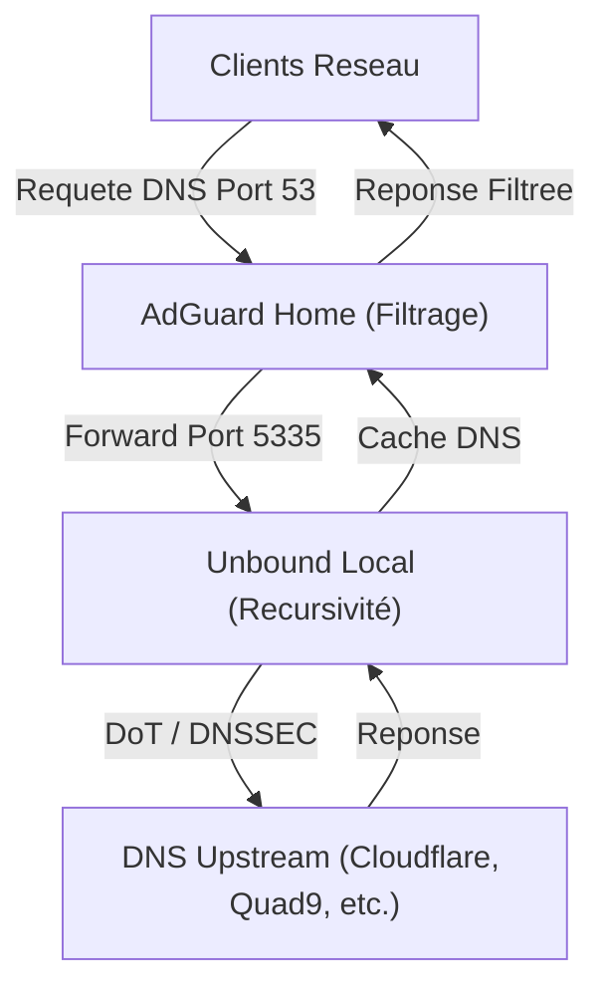

# AdGuard Home & Unbound All-in-One Installer pour Proxmox LXC

[](https://opensource.org/licenses/MIT)
[](CHANGELOG.md)

Ce script Bash installe et configure **AdGuard Home** et **Unbound** comme solution DNS complète sur un conteneur **Proxmox LXC** (basé sur Debian/Ubuntu).

Inspiré par le style des [Proxmox VE Helper-Scripts](https://tteck.github.io/Proxmox/), il propose une **interface interactive** (menu Whiptail) et une configuration **ultra-optimisée** basée sur les ressources de votre système.


## 🏗️ Architecture DNS


```mermaid
graph TD
    Client[Clients Reseau] -->|Requete DNS Port 53| AGH["AdGuard Home (Filtrage)"]
    AGH -->|Forward Port 5335| Unbound["Unbound Local (Recursivité)"]
    Unbound -->|DoT / DNSSEC| Upstream["DNS Upstream (Cloudflare, Quad9, etc.)"]
    Upstream -->|Reponse| Unbound
    Unbound -->|Cache DNS| AGH
    AGH -->|Reponse Filtree| Client
```

## ✨ Fonctionnalités

### 🚀 Installation & Mise à jour

- **AdGuard Home** : Téléchargement automatique (GitHub) avec **vérification d'intégrité SHA256**.
- **Unbound** : Installation et configuration récursive haute performance.
- **Récupération Intelligente** : Détecte une installation existante et optimise la configuration sans écraser vos données (filtres, stats).

### ⚙️ Optimisation Dynamique (Multi-Tiers)

Le script analyse vos cœurs CPU et votre RAM pour calibrer Unbound scientifiquement :

- **Threads & Slabs** : Alignés sur le nombre de cœurs (Puissance de 2) pour réduire la contention (Lock Contention).
- **Buffers Réseau** : Augmentation des buffers UDP (Sysctl) pour encaisser les pics de trafic.
- **Profils Mémoire** : De **Micro** (< 512MB) à **Premium** (> 4GB).

### 🛡️ Sécurité & Gestion

- **DNS-over-TLS (DoT)** : **4 fournisseurs** au choix — Cloudflare, Quad9, Google DNS, AdGuard DNS.
- **Menu enrichi (v3.3.0)** :
  - **Health Check + Diagnostics** : Diagnostic complet Unbound & AdGuard + benchmark DNS en un clic.
  - **Réparer / Reconfigurer** : Recalcule la config Unbound sans réinstaller.
  - **Stats** : Vue en temps réel de l'efficacité du cache.
  - **Désinstaller** : Suppression propre et complète (retour menu, pas de sortie forcée).
- **Auto-Update (v3.2.0)** : Le script peut se mettre à jour tout seul.
- **Production-Ready (v3.2.5)** : Retry logic, backup automatique, health checks intégrés.
- **Performance & UX (v3.3.0)** : Indicateur d'étapes, temps écoulé par opération, skip apt intelligent.

## 🆕 Nouveautés v3.3.0

### ⚡ Performances

- **Skip apt intelligent** : `apt-get install unbound` ignoré si le paquet est déjà présent (`dpkg -l`)
- **Root hints en arrière-plan** : téléchargement parallèle pendant la génération des clés TLS → gain ~2-3s
- **Cache apt** : `apt-get update` skippé si le cache a moins d'1 heure
- `--no-install-recommends` sur tous les `apt-get install`

### 🎨 User Experience

- **Compteur d'étapes** : chaque opération affiche `[2/4]` dans le prompt
- **Temps écoulé** : les opérations longues (≥500ms) affichent leur durée : `✓ Unbound installé (1 234ms)`
- **Statut live dans le menu** : `Unbound: active | AdGuard: active | Upstream: cloudflare`
- **4 fournisseurs DoT** : Cloudflare, Quad9, **Google DNS**, **AdGuard DNS**

### 🔧 Nouveaux flags CLI

| Flag | Description |
|------|-------------|
| `--repair` | Reconfigure Unbound + upstream AGH sans réinstaller |
| `--health` | Lance le health check complet en mode non-interactif |
| `--stats` | Affiche les stats Unbound en temps réel |
| `--upstream <nom>` | Force l'upstream (ex: `--upstream google`) |

---

## 🧪 v3.2.5 : Production-Ready Utilities & Tests

### Bibliothèques Utilitaires (v3.2.5)

Le script principal **intègre automatiquement** des bibliothèques bash production-ready suivant les standards [bash-pro](https://github.com/sickn33/antigravity-awesome-skills) :

- **`lib/common.sh`** - 12+ fonctions utilitaires :
  - ✅ Retry logic réseau avec validation checksum
  - ✅ Validation IP/Port robuste
  - ✅ Backup/Rollback automatique
  - ✅ Gestion services avec health checks
  - ✅ Opérations fichiers atomiques

- **`lib/health_checks.sh`** - Diagnostics DNS complets :
  - ✅ Tests résolution DNS, DNSSEC, DoT
  - ✅ Health checks Unbound & AdGuard (5 vérifications chacun)
  - ✅ Benchmark performance (queries/sec)
  - ✅ Génération rapports détaillés

### Suite de Tests Automatisés

```bash
# Exécuter tous les tests
./tests/test_suite.sh

# Test spécifique
./tests/test_suite.sh --test validate_ipv4

# 25 tests : validation, système, performance
```

### Documentation Contributeurs

- **[CONTRIBUTING.md](CONTRIBUTING.md)** - Standards de code, processus de contribution
- **[USAGE_GUIDE.md](USAGE_GUIDE.md)** - Exemples d'intégration et utilisation avancée
- **[IMPROVEMENTS.md](IMPROVEMENTS.md)** - Détails techniques des améliorations

## 🚀 Installation Rapide

```bash
bash -c "$(curl -fsSL https://raw.githubusercontent.com/nickdesi/unbound-adguard-installer/main/install_unbound_interactive.sh)"
```

Ou clonez le dépôt :

```bash
git clone https://github.com/nickdesi/unbound-adguard-installer.git
cd unbound-adguard-installer
chmod +x install_unbound_interactive.sh
sudo ./install_unbound_interactive.sh
```

## 📋 Options de Ligne de Commande

```text
Usage: ./install_unbound_interactive.sh [--upstream <nom>] [OPTION]

Options:
  --install            Installation complète (AdGuard Home + Unbound)
  --repair             Reconfigurer Unbound + AdGuard (sans réinstaller)
  --unbound-only       Installer/reconfigurer uniquement Unbound
  --health             Exécuter le health check complet
  --stats              Afficher les stats Unbound en temps réel
  --update             Mettre à jour ce script depuis GitHub
  --uninstall          Désinstaller AdGuard Home et Unbound
  --upstream <nom>     Forcer l'upstream (cloudflare|quad9|google|adguard)
  --help               Afficher l'aide

Sans option, le script affiche un menu interactif.
```

### Exemples

```bash
# Installation silencieuse avec Google DNS
sudo ./install_unbound_interactive.sh --upstream google --install

# Diagnostic rapide
sudo ./install_unbound_interactive.sh --health

# Stats live
sudo ./install_unbound_interactive.sh --stats

# Reconfigurer l'upstream sans tout réinstaller
sudo ./install_unbound_interactive.sh --upstream quad9 --repair
```

## 🎛️ Menu Interactif (v3.3.0)

Le menu affiche en en-tête le statut live des services et l'upstream actif.

| # | Action | Description |
|---|--------|-------------|
| 1 | **Installer (Complet)** | Déploiement total AGH + Unbound, avec compteur d'étapes et health check final |
| 2 | **Réparer / Reconfigurer** | Recalibre Unbound + upstream AGH sans réinstaller |
| 3 | **Health Check + Diagnostics** | Diagnostic complet 10-points + benchmark DNS |
| 4 | **Stats Unbound** | Vue scrollable des stats cache en temps réel |
| 5 | **MAJ Système** | `apt-get upgrade` Debian/Ubuntu |
| 6 | **MAJ Script** | Mise à jour depuis GitHub |
| 7 | **Désinstaller** | Suppression propre, retour au menu |
| 8 | **Quitter** | — |

## ⚙️ Configuration par défaut

- **Unbound** : Port `5335` (localhost)
- **AdGuard Home UI** : Port `3000`
- **Logs** : `/var/log/adguard-unbound-installer.log`
- **Bibliothèques** : `lib/common.sh`, `lib/health_checks.sh` (chargées automatiquement)
- **Tests** : `./tests/test_suite.sh` (25 tests automatisés)

## 🔧 Dépannage & Logs

### Voir les logs du script

```bash
tail -f /var/log/adguard-unbound-installer.log
```

### Vérifier les services

```bash
sudo systemctl status AdGuardHome
sudo systemctl status unbound
sudo unbound-checkconf
```

### Test de résolution directe (Unbound)

```bash
dig @127.0.0.1 -p 5335 google.com
```

### Health Check Automatisé (Nouveau)

```bash
# Sourcer la bibliothèque
source lib/health_checks.sh

# Exécuter le diagnostic complet
run_full_health_check

# Générer un rapport de performance
generate_performance_report

# Benchmark (1000 requêtes)
benchmark_dns_performance 1000
```

## 🔄 Migration LXC Debian → Alpine

Un script dédié permet de migrer votre configuration DNS complète vers un conteneur Alpine Linux.

### Prérequis

1. Conteneur **source** : LXC Debian avec AdGuard Home + Unbound (installés via ce script)
2. Conteneur **cible** : LXC Alpine avec AdGuard Home pré-installé via [community-scripts](https://github.com/community-scripts/ProxmoxVE)

### Utilisation (depuis l'hôte Proxmox)

```bash
# Télécharger et exécuter
curl -fsSL https://raw.githubusercontent.com/nickdesi/unbound-adguard-installer/main/migrate_dns_lxc.sh -o migrate_dns_lxc.sh
chmod +x migrate_dns_lxc.sh
sudo ./migrate_dns_lxc.sh <SOURCE_ID> <TARGET_ID>

# Exemple : migrer du CT 100 vers CT 101
sudo ./migrate_dns_lxc.sh 100 101
```� Développement & Contribution

Contributions bienvenues ! Le projet suit les standards **bash-pro** avec :

- ✅ 25 tests automatisés (`./tests/test_suite.sh`)
- ✅ Linting shellcheck obligatoire
- ✅ Documentation complète
- ✅ Guide de contribution : [CONTRIBUTING.md](CONTRIBUTING.md)

### Structure du Projet

```
├── install_unbound_interactive.sh  # Script principal
├── migrate_dns_lxc.sh              # Migration Debian → Alpine
├── lib/
│   ├── common.sh                   # Fonctions utilitaires
│   └── health_checks.sh            # Tests santé DNS
├── tests/
│   └── test_suite.sh               # Suite de tests automatisés
└── docs/
    ├── CONTRIBUTING.md             # Guide contributeurs
    ├── USAGE_GUIDE.md              # Guide utilisation
    └── IMPROVEMENTS.md             # Détails améliorations
```

## 🙏 Crédits

- Inspiré par [tteck's Proxmox VE Helper-Scripts](https://github.com/community-scripts/ProxmoxVE)
- [AdGuard Home](https://adguard.com/adguard-home/overview.html)
- [NLnet Labs Unbound](https://nlnetlabs.nl/projects/unbound/about/)
- Standards bash : [antigravity-awesome-skills](https://github.com/sickn33/antigravity-awesome-skills)
- Token optimization : [RTK](https://github.com/rtk-ai/rtk
- ✅ Migration des configs AdGuard (YAML + data/stats)
- ✅ Migration de la config Unbound
- ✅ Installation d'Unbound sur Alpine (`apk add`)
- ✅ Gestion des services systemd (Debian) ↔ OpenRC (Alpine)
- ✅ Vérifications de sécurité et permissions
- ✅ Test de résolution DNS post-migration

## 📜 Licence

Ce projet est sous licence MIT. Voir le fichier [LICENSE](LICENSE) pour plus de détails.

## 🙏 Crédits

- Inspiré par [tteck's Proxmox VE Helper-Scripts](https://github.com/community-scripts/ProxmoxVE)
- [AdGuard Home](https://adguard.com/adguard-home/overview.html)
- [NLnet Labs Unbound](https://nlnetlabs.nl/projects/unbound/about/)

## ⚠️ Disclaimer

Ce script modifie la configuration système. Utilisez-le à vos propres risques. Il est recommandé de faire des sauvegardes avant toute modification majeure.
