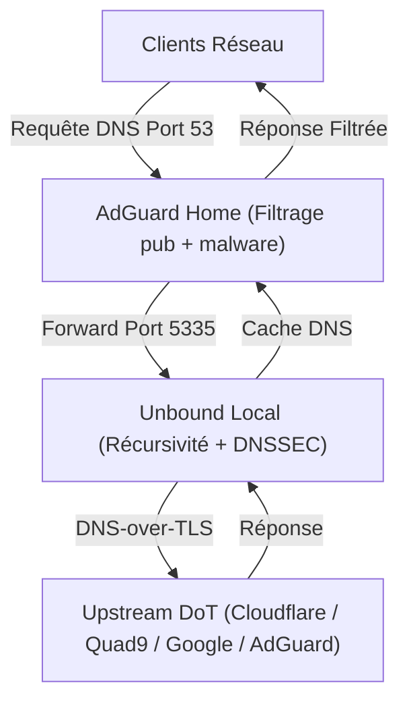

# AdGuard Home & Unbound All-in-One Installer pour Proxmox LXC

[](https://opensource.org/licenses/MIT)
[](CHANGELOG.md)
[](https://www.gnu.org/software/bash/)

Ce script Bash installe et configure **AdGuard Home** et **Unbound** comme solution DNS complète sur un conteneur **Proxmox LXC** (basé sur Debian/Ubuntu).

Inspiré par le style des [Proxmox VE Helper-Scripts](https://tteck.github.io/Proxmox/), il propose une **interface interactive** (menu Whiptail) et une configuration **ultra-optimisée** basée sur les ressources de votre système.

## 🏗️ Architecture DNS


```mermaid
graph TD
    Client[Clients Réseau] -->|Requête DNS Port 53| AGH["AdGuard Home (Filtrage pub + malware)"]
    AGH -->|Forward Port 5335| Unbound["Unbound Local (Récursivité + DNSSEC)"]
    Unbound -->|DNS-over-TLS| Upstream["Upstream DoT (Cloudflare / Quad9 / Google / AdGuard)"]
    Upstream -->|Réponse| Unbound
    Unbound -->|Cache DNS| AGH
    AGH -->|Réponse Filtrée| Client
```

## ✨ Fonctionnalités

### 🚀 Installation & Configuration

- **AdGuard Home** : téléchargement automatique depuis GitHub, détection d'architecture (amd64, arm64, armv7).
- **Unbound** : installation et configuration récursive haute performance avec root hints à jour.
- **Idempotent** : détecte une installation existante et re-configure sans écraser vos données (filtres, stats).
- **Fail-fast** : si `lib/common.sh` est absent, le script s'arrête immédiatement avec un message clair.

### ⚙️ Optimisation Dynamique (Multi-Tiers)

Le script analyse vos cœurs CPU et votre RAM pour calibrer Unbound automatiquement :

| Profil | RAM | Threads | Cache rrset | Cache msg |
|--------|-----|---------|-------------|----------|
| Micro | < 512 MB | auto | 16 MB | 8 MB |
| Small | < 1 GB | auto | 64 MB | 32 MB |
| Medium | < 4 GB | auto | 256 MB | 128 MB |
| Premium | ≥ 4 GB | auto | 512 MB | 256 MB |

- **Threads & Slabs** : alignés sur le nombre de cœurs (puissance de 2) pour réduire la contention.
- **Buffers UDP** : sysctl optimisés pour absorber les pics de trafic DNS.

### 🛡️ Sécurité & Vie Privée

- **DNS-over-TLS (DoT)** : 4 fournisseurs au choix — Cloudflare, Quad9, Google DNS, AdGuard DNS.
- **DNSSEC** : `harden-dnssec-stripped`, `harden-algo-downgrade` activés.
- `hide-identity`, `hide-version`, `use-caps-for-id` activés par défaut.
- Adresses privées protégées (RFC1918).

### 🧰 Mode Dry-Run

Simulez l'intégralité de l'installation sans modifier le système :

```bash
sudo ./install_unbound_interactive.sh --dry-run --install
```

Toutes les opérations système sont affichées avec le préfixe `[DRY-RUN]`.

## 🚀 Installation Rapide

> ⚠️ **Important** : clonez le dépôt complet. Le script nécessite `lib/common.sh` pour fonctionner.

```bash
git clone https://github.com/nickdesi/unbound-adguard-installer.git
cd unbound-adguard-installer
chmod +x install_unbound_interactive.sh
sudo ./install_unbound_interactive.sh
```

Ou en one-liner (avec clone automatique) :

```bash
git clone https://github.com/nickdesi/unbound-adguard-installer.git /tmp/dns-installer && sudo /tmp/dns-installer/install_unbound_interactive.sh
```

## 📋 Options de Ligne de Commande

```text
Usage: ./install_unbound_interactive.sh [OPTIONS]

Options:
  --install            Installation complète (AdGuard Home + Unbound)
  --repair             Reconfigurer Unbound + AdGuard (sans réinstaller)
  --unbound-only       Installer/reconfigurer uniquement Unbound
  --health             Exécuter le health check complet
  --stats              Afficher les stats Unbound
  --update             Mettre à jour ce script depuis GitHub
  --uninstall          Désinstaller AdGuard Home et Unbound
  --upstream <nom>     Forcer l'upstream (cloudflare|quad9|google|adguard)
  --dry-run            Simuler les actions sans modifier le système
  --help               Afficher cette aide

Sans option : menu interactif.
```

### Exemples

```bash
# Installation silencieuse avec Quad9
sudo ./install_unbound_interactive.sh --upstream quad9 --install

# Simuler une installation sans rien modifier
sudo ./install_unbound_interactive.sh --dry-run --install

# Diagnostic complet
sudo ./install_unbound_interactive.sh --health

# Stats live Unbound
sudo ./install_unbound_interactive.sh --stats

# Reconfigurer l'upstream sans tout réinstaller
sudo ./install_unbound_interactive.sh --upstream cloudflare --repair
```

## 🎛️ Menu Interactif

Le menu affiche en temps réel le statut des services et l'upstream actif.

| # | Action | Description |
|---|--------|-------------|
| 1 | **Installer (Complet)** | Déploiement total AGH + Unbound, compteur d'étapes + health check final |
| 2 | **Réparer / Reconfigurer** | Recalibre Unbound + upstream AGH sans réinstaller |
| 3 | **Health Check + Diagnostics** | Diagnostic complet 10-points + benchmark DNS |
| 4 | **Stats Unbound** | Vue scrollable des stats cache |
| 5 | **MAJ Système** | `apt-get upgrade` Debian/Ubuntu |
| 6 | **MAJ Script** | Mise à jour depuis GitHub |
| 7 | **Désinstaller** | Suppression propre, retour au menu |
| 8 | **Quitter** | — |

## 🗂️ Structure du Projet

```
unbound-adguard-installer/
├── install_unbound_interactive.sh  # Script principal (v3.4.1)
├── lib/
│   ├── common.sh                   # Fonctions utilitaires (OBLIGATOIRE)
│   └── health_checks.sh            # Diagnostics DNS (optionnel, dégradation gracieuse)
├── tests/
│   └── test_suite.sh               # 25 tests automatisés
├── CHANGELOG.md
├── CONTRIBUTING.md
├── USAGE_GUIDE.md
└── LICENSE
```

> `lib/common.sh` est **obligatoire** — le script s'arrête avec `FATAL` s'il est absent.  
> `lib/health_checks.sh` est **optionnel** — les fonctions de diagnostic sont désactivées si absent.

## ⚙️ Configuration par Défaut

| Paramètre | Valeur |
|-----------|--------|
| Port Unbound | `5335` (localhost) |
| Port AdGuard Home UI | `3000` |
| Logs | `/var/log/adguard-unbound-installer.log` |
| Upstream par défaut | `cloudflare` (DoT) |
| Backup automatique | Oui (timestamp) |

## 🧪 Tests Automatisés

```bash
# Exécuter tous les tests
./tests/test_suite.sh

# Test spécifique
./tests/test_suite.sh --test validate_ipv4
```

25 tests couvrant : validation IP/port, détection système, logique de performance, backup/rollback.

## 🔧 Dépannage

### Logs du script

```bash
tail -f /var/log/adguard-unbound-installer.log
```

### Vérifier les services

```bash
sudo systemctl status AdGuardHome
sudo systemctl status unbound
sudo unbound-checkconf
```

### Test de résolution DNS (Unbound direct)

```bash
dig @127.0.0.1 -p 5335 google.com
```

### Health Check manuel

```bash
source lib/health_checks.sh
run_full_health_check
benchmark_dns_performance 1000
```

### Erreur "FATAL: lib/common.sh introuvable"

Vous avez téléchargé uniquement le script principal. Clonez le repo complet :

```bash
git clone https://github.com/nickdesi/unbound-adguard-installer.git
```

## 🔄 Changelog

### v3.4.1
- **Fix critique** : sourcing de `lib/common.sh` en fail-fast obligatoire (exit immédiat si absent)
- **Flag `HEALTH_CHECKS_AVAILABLE`** : remplace les `type run_full_health_check` — plus fiable, pas de fork inutile
- Message d'erreur explicite si `lib/health_checks.sh` manquant

### v3.4.0
- **Mode `--dry-run`** : simulation complète sans modification système, combinable avec tous les flags
- **Validation upstream** : `--upstream toto` retourne une erreur explicite
- **Idempotence AGH** : `configure_adguard_upstream` détecte si déjà configuré
- **`msg_error` sur stderr** : les erreurs n'interfèrent plus avec les pipes
- Suppression de `migrate_dns_lxc.sh`

### v3.3.0
- Compteur d'étapes `[2/4]`, temps écoulé par opération (≥ 500ms)
- Statut live dans le menu : `Unbound: active | AdGuard: active | Upstream: cloudflare`
- Ajout Google DNS et AdGuard DNS comme upstreams DoT
- Flags `--repair`, `--health`, `--stats`

### v3.2.5
- `lib/common.sh` : retry logic, validation IP/port, backup/rollback, services
- `lib/health_checks.sh` : diagnostics DNS complets, benchmark
- Suite de 25 tests automatisés

## 👥 Contribution

Contributions bienvenues ! Voir [CONTRIBUTING.md](CONTRIBUTING.md).

- ✅ Linting `shellcheck` obligatoire
- ✅ 25 tests automatisés à passer
- ✅ Commits conventionnels (`feat:`, `fix:`, `docs:`)

## 🙏 Crédits

- Inspiré par [tteck's Proxmox VE Helper-Scripts](https://github.com/community-scripts/ProxmoxVE)
- [AdGuard Home](https://adguard.com/adguard-home/overview.html)
- [NLnet Labs Unbound](https://nlnetlabs.nl/projects/unbound/about/)

## ⚠️ Disclaimer

Ce script modifie la configuration système (sysctl, services, `/etc/resolv.conf`). Utilisez-le à vos propres risques. Des sauvegardes automatiques sont créées avant chaque modification.

## 📜 Licence

Ce projet est sous licence MIT. Voir [LICENSE](LICENSE).
